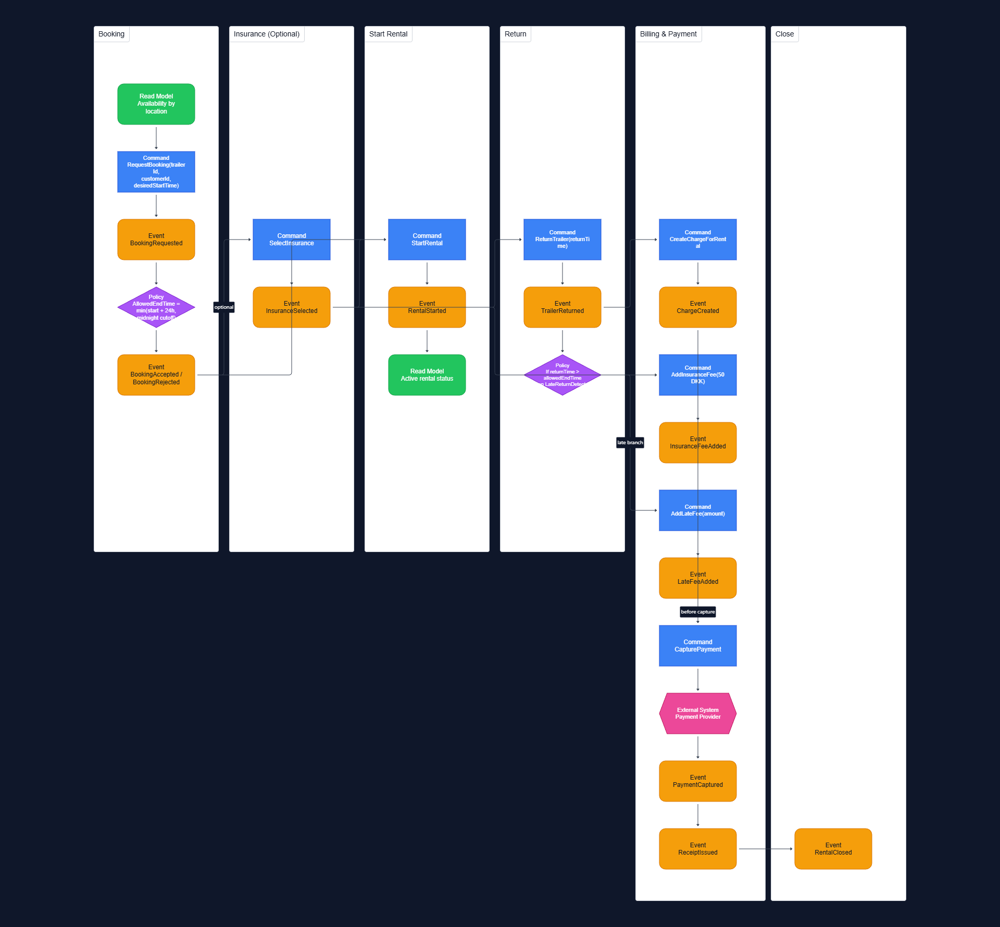

# 3. Event Storming

This section documents the requirements discovery work performed using **Event Storming**. The goal is to identify the most important domain events, commands, policies, read models, and external systems for the MyTrailer short-term rental flow.

The Event Storming outcome is used to:
- validate the end-to-end business process,
- reveal missing rules and edge cases,
- and provide a foundation for Strategic and Tactical DDD.

## 3.1 Method and Notation

The Event Storming was structured around the main short-term rental journey:
1. Booking a trailer in the app
2. Starting the rental (pickup)
3. Returning the trailer
4. Applying fees (insurance/late fee)
5. Capturing payment and closing the rental

Notation used (typical Event Storming color semantics):
- **Domain Events** (what *happened*): past tense, e.g., `BookingAccepted`
- **Commands** (what someone/system *asks to happen*): imperative, e.g., `RequestBooking`
- **Policies / Process Managers** (automation/rules that react to events): “When X then do Y”
- **Read Models** (views needed by the app): availability, booking status, receipt
- **External Systems**: payment provider (integration boundary)

## 3.2 Core Timeline (Happy Path)

This is the primary scenario: a customer books a trailer, selects insurance, starts the rental, returns it on time, and payment is captured (insurance only).

### Booking
**Command**
- `RequestBooking(trailerId, customerId, desiredStartTime)`

**Key policy**
- **Allowed end time calculation**:
  - `allowedEndTime = min(startTime + 24 hours, midnight cut-off)`
  - This is directly justified by the case requirement that short-term rentals must end by **midnight at the latest**.

**Domain events**
- `BookingRequested`
- `BookingAccepted`
- `AllowedEndTimeCalculated` (optional event; can also be treated as an internal rule in the Rental aggregate)

**Read models**
- “Available trailers by location”
- “My upcoming bookings”

### Optional insurance selection
**Command**
- `SelectInsurance(rentalId, selected = true|false)`

**Domain event**
- `InsuranceSelected`

**Read models**
- “Booking details (including insurance selection)”

### Start rental (pickup)
**Command**
- `StartRental(rentalId)`

**Domain event**
- `RentalStarted`

**Read model**
- “Active rental status”

### Return trailer (on time)
**Command**
- `ReturnTrailer(rentalId, returnTime)`

**Domain event**
- `TrailerReturned`

**Policy**
- If returned on or before `allowedEndTime`, proceed with billing without late fee.

### Billing and payment
**Command**
- `CreateChargeForRental(rentalId)`
- `AddInsuranceFee(chargeId, 50 DKK)` (if insurance was selected)
- `CapturePayment(chargeId)`

**Domain events**
- `ChargeCreated`
- `InsuranceFeeAdded`
- `PaymentCaptured`
- `ReceiptIssued`
- `RentalClosed`

**External system**
- `PaymentProvider` (authorization/capture)

**Read models**
- “Receipt / payment confirmation”
- “Rental history”

## 3.3 Variations and Edge Cases

Event Storming also highlighted important variations that influence the architecture and the domain rules.

### A) Booking rejected (availability conflict)
If a trailer is already booked/rented for the requested time window.

**Command**
- `RequestBooking(...)`

**Domain event**
- `BookingRejected` (reason: “Not available”)

**Read model**
- “Availability calendar / alternative trailers”

### B) Late return and excess rental fee
If the trailer is returned after `allowedEndTime`, an excess rental fee must be applied before rental closure.

**Command**
- `ReturnTrailer(rentalId, returnTime)`

**Domain events**
- `TrailerReturned`
- `LateReturnDetected`

**Policy**
- When `LateReturnDetected` then:
  - calculate late fee (excess rental fee),
  - add it to the charge,
  - capture payment,
  - close rental.

**Commands**
- `AddLateFee(chargeId, amount)`
- `CapturePayment(chargeId)`

**Domain events**
- `LateFeeAdded`
- `PaymentCaptured`
- `RentalClosed`

**Open design decision**
- The exact fee calculation (fixed vs per hour) is not specified in the case and is treated as a business rule owned by Billing.

### C) Midnight cut-off behavior (important rule emphasis)
If a rental starts late in the day, the midnight cut-off typically becomes the limiting factor rather than the 24-hour max.

This rule must be enforced consistently in:
- booking acceptance logic, and
- allowed end time calculation for the rental.

## 3.4 Outputs from Event Storming

The Event Storming results are summarized into the following artifact types:

### Key commands
- `RequestBooking`
- `SelectInsurance`
- `StartRental`
- `ReturnTrailer`
- `CreateChargeForRental`
- `AddInsuranceFee`
- `AddLateFee`
- `CapturePayment`

### Key domain events
- `BookingAccepted` / `BookingRejected`
- `RentalStarted`
- `TrailerReturned`
- `LateReturnDetected`
- `InsuranceFeeAdded`
- `LateFeeAdded`
- `PaymentCaptured`
- `RentalClosed`
- `ReceiptIssued`

### Key policies/processes
- Calculate allowed end time based on max 24h and midnight cut-off
- Detect late return and trigger fee + billing flow
- Prevent booking conflicts (no overlapping rentals per trailer)

### Key read models (app views)
- Trailer availability by location
- Booking details and status
- Active rental status
- Rental history and receipt

### Key external systems
- Payment provider for payment capture (and optional authorization)

## 3.5 Diagrams

This section references two diagrams:

1. **Event Storming board (raw)** – a screenshot from a collaborative board tool showing notes and lanes  
   Suggested file name: `docs/diagrams/event-storming-board.png`

2. **Cleaned Event Storming result** – a simplified, readable diagram that is easy to present and grade  
   Suggested file name: `docs/diagrams/event-storming-cleaned.png`

Once the diagrams are created, embed them here:

