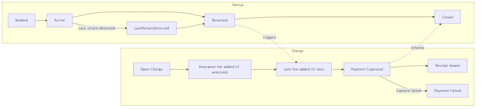
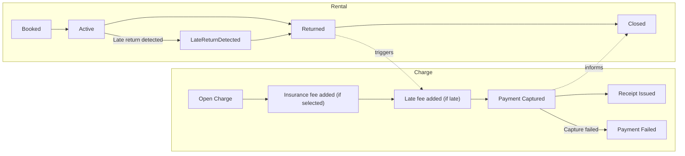

# 5. Tactical DDD

This section documents the **Tactical Domain-Driven Design** model for the MyTrailer short-term rental solution. It defines the key domain objects, aggregates, commands, domain events, and invariants that enforce the business rules discovered during Event Storming.

The tactical model is intentionally scoped to the short-term rental via app and focuses on the parts of the domain that are most critical:
- booking and rental lifecycle correctness,
- enforcement of the midnight cut-off / max 24-hour rule,
- and integration points for billing (insurance + late fee) and payment.

## 5.1 Design approach

The tactical design is organized around **aggregates**. Each aggregate:
- owns a consistency boundary,
- enforces invariants (business rules that must always hold),
- and publishes domain events when state changes.

In this case study, the primary aggregates are:
1. **Rental** (core domain aggregate)
2. **Charge** (billing aggregate)

Partner settlement and identity are treated as supporting/generic and are not modeled as full aggregates here, because they are not the core focus of the case rules.

## 5.2 Value Objects

### 5.2.1 TrailerId
**Definition:** Uniquely identifies a trailer.

- `TrailerId = (locationId, trailerNumber)`

**Reasoning:** The case describes trailers as being tied to partner locations and referenced using a location + trailer number.

### 5.2.2 RentalPeriod
**Definition:** Represents the time boundaries for a rental.

- `startTime`
- `allowedEndTime`

**Key rule:**
- `allowedEndTime = min(startTime + 24 hours, midnight cut-off)`

This rule is derived directly from the case requirement that short-term rentals are max 24 hours and must end by midnight at the latest.

## 5.3 Aggregate: Rental (Core Domain)

### 5.3.1 Purpose and responsibilities
The **Rental** aggregate owns the end-to-end lifecycle of a short-term rental:
- booking acceptance/rejection,
- rental start,
- trailer return,
- and emitting events that trigger billing and downstream processes.

The Rental aggregate is the primary source of truth for:
- availability decisions (no overlapping rentals per trailer),
- the allowed end time rule,
- rental status transitions.

### 5.3.2 State (conceptual)
A Rental aggregate can be described with these fields:

- `rentalId`
- `trailerId : TrailerId`
- `customerId`
- `period : RentalPeriod` (startTime, allowedEndTime)
- `returnTime` (nullable until returned)
- `status` (Booked | Active | Returned | Closed)
- `insuranceSelected` (boolean)

### 5.3.3 Commands (Rental)
Commands represent intentions from the user (app) or internal processes.

- `RequestBooking(trailerId, customerId, desiredStartTime)`
- `SelectInsurance(rentalId, selected)`
- `StartRental(rentalId)`
- `ReturnTrailer(rentalId, returnTime)`
- `CloseRental(rentalId)` (typically triggered by a billing outcome such as payment captured)

### 5.3.4 Domain Events (Rental)
Events represent facts that have happened in the domain.

- `BookingAccepted(rentalId, trailerId, customerId, startTime, allowedEndTime)`
- `BookingRejected(trailerId, customerId, desiredStartTime, reason)`
- `InsuranceSelected(rentalId, selected)`
- `RentalStarted(rentalId, startTime)`
- `TrailerReturned(rentalId, returnTime)`
- `LateReturnDetected(rentalId, returnTime, allowedEndTime)` (raised when return is late)
- `RentalClosed(rentalId)`

### 5.3.5 Invariants (Rental)
These invariants must always hold within the Rental consistency boundary:

1. **No overlapping rentals for a trailer**
   - A booking can only be accepted if there is no overlapping booking/rental for the same `TrailerId` in the requested period.

2. **Allowed end time rule**
   - `allowedEndTime` must always be computed as:
     - `min(startTime + 24 hours, midnight cut-off)`
   - This ensures rentals end by midnight at the latest (as stated in the case).

3. **Valid lifecycle transitions**
   - A rental cannot be started unless it is in `Booked`.
   - A rental cannot be returned unless it is `Active`.
   - A rental cannot be closed unless it has been returned and billing has completed (conceptually).

4. **Late return detection**
   - If `returnTime > allowedEndTime`, the rental must produce `LateReturnDetected` so Billing can add an excess rental fee before closure.

### 5.3.6 Notes on availability consistency
In a real implementation, preventing overlap requires a concurrency-safe mechanism (e.g., unique constraints or locking at booking time). In this assignment, the key point is that the responsibility for the rule is owned by the Rental domain, and the architecture should support enforcing it.

## 5.4 Aggregate: Charge (Billing & Payments)

### 5.4.1 Purpose and responsibilities
The **Charge** aggregate represents the billable outcome of a rental. It owns:
- which line items are billed (insurance and/or late fee),
- total amount calculation,
- and triggering payment capture with a payment provider.

### 5.4.2 State (conceptual)
A Charge aggregate can be described with:

- `chargeId`
- `rentalId`
- `lineItems` (insurance fee, late fee, etc.)
- `totalAmount`
- `status` (Open | Captured | Failed)

### 5.4.3 Commands (Charge)
- `CreateChargeForRental(rentalId)`
- `AddInsuranceFee(chargeId, amount = 50 DKK)`
- `AddLateFee(chargeId, amount)`
- `CapturePayment(chargeId)`

### 5.4.4 Domain Events (Charge)
- `ChargeCreated(chargeId, rentalId)`
- `InsuranceFeeAdded(chargeId, amount = 50 DKK)`
- `LateFeeAdded(chargeId, amount)`
- `PaymentCaptured(chargeId, rentalId, totalAmount)`
- `PaymentFailed(chargeId, reason)`
- `ReceiptIssued(chargeId, rentalId)`

### 5.4.5 Invariants (Charge)
1. **Insurance fee is fixed**
   - If insurance is selected, the insurance line item amount is always **50 DKK**.

2. **Late fee is only added when needed**
   - The late fee line item is added only when `LateReturnDetected` has occurred (or an equivalent input from Rental).

3. **Payment capture occurs once**
   - A Charge cannot be captured more than once.

4. **Receipt issuance follows capture**
   - A receipt can only be issued after successful capture.

## 5.5 Cross-context interaction (tactical view)

The tactical model makes ownership explicit:

- **Rental Management** owns:
  - time rules,
  - lifecycle transitions,
  - “late or not late” detection.

- **Billing & Payments** owns:
  - monetary calculation (insurance + late fee),
  - payment provider integration,
  - final confirmation (`PaymentCaptured`) used to close the rental.

This separation keeps the core domain clean and reduces coupling.

## 5.6 Lifecycle overview (diagram)

A concise view of the two aggregates’ lifecycles and how late return affects billing/closure.

Diagram:

Mermaid source (for regeneration)

