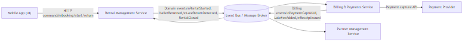
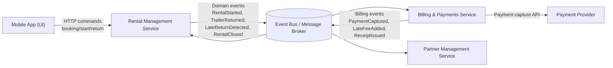

# 6. Message Flows (Service Integration)

This section documents the **flow of messages between services** for the MyTrailer short-term rental solution. The purpose is to show how bounded contexts collaborate while keeping responsibilities separated.

The integration approach is:
- **Synchronous HTTP** from the mobile app to the Rental Management service (user-driven actions)
- **Asynchronous domain events** between internal services (billing and partner usage are reactions to domain facts)

This structure reduces coupling, makes ownership clear, and aligns with the Event Storming output.

## 6.1 Services and responsibilities (integration view)

### Mobile App (UI)
- Initiates user actions: booking, start rental, return trailer
- Displays read models: availability, booking status, receipt

### Rental Management Service (Core Domain)
- Validates and processes booking requests
- Enforces time rules (max 24 hours + midnight cut-off)
- Tracks rental lifecycle (Booked → Active → Returned → Closed)
- Publishes rental lifecycle events

### Billing & Payments Service
- Creates charges for rentals
- Adds insurance fee (50 DKK) and/or late fee (excess rental fee)
- Captures payment via an external payment provider
- Publishes billing outcome events (e.g., `PaymentCaptured`)

### Partner Management Service (optional integration consumer)
- Records usage per location for settlement and reporting
- Reacts to `RentalClosed` (or similar) events

### Event Bus / Message Broker
- Carries published domain events between services
- Enables publish/subscribe communication

### External Payment Provider
- Performs payment capture (and optional authorization)
- Considered outside the system boundary

## 6.2 Message types and contracts

The solution uses two main message types:

1. **Commands (sync)**
   - Initiated by users via the mobile app.
   - Sent as HTTP requests to the Rental Management service.

2. **Domain Events (async)**
   - Published by services as facts after state changes.
   - Consumed by other services to trigger their own processes.

Naming convention:
- Commands use imperative verbs (e.g., `ReturnTrailer`)
- Events use past tense (e.g., `TrailerReturned`)

## 6.3 Primary flow: Booking → Start Rental → Return (on time) → Close

This is the normal flow where the customer selects insurance and returns on time.

### Step-by-step sequence (minimal coupling version)

**1) Book trailer (sync)**
- App → Rental Management: `RequestBooking(trailerId, customerId, desiredStartTime)`
- Rental Management:
  - checks availability for the requested time window
  - computes `allowedEndTime = min(start + 24h, midnight cut-off)`
  - persists the booking as a Rental in `Booked` state

**2) Booking result (sync response)**
- Rental Management → App:
  - success: booking/rental id + allowedEndTime
  - or reject with reason (not available / invalid time)

**3) Select insurance (sync)**
- App → Rental Management: `SelectInsurance(rentalId, selected=true)`
- Rental Management records insurance selection in the Rental aggregate.

**4) Start rental (sync)**
- App → Rental Management: `StartRental(rentalId)`
- Rental Management transitions rental to `Active` and emits:

  Event: `RentalStarted`

**5) Return trailer on time (sync)**
- App → Rental Management: `ReturnTrailer(rentalId, returnTime)`
- Rental Management:
  - checks `returnTime <= allowedEndTime`
  - transitions to `Returned`
  - emits:

  Event: `TrailerReturned` (on-time path)

**6) Billing reacts (async)**
- Billing & Payments consumes `TrailerReturned` and:
  - creates a charge for the rental
  - adds insurance fee if insurance was selected
  - does not add late fee (because return was on time)
  - calls payment provider to capture payment (if totalAmount > 0)

**7) Billing publishes outcome (async)**
- Billing & Payments emits:
  - `PaymentCaptured` (and optionally `ReceiptIssued`)

**8) Rental closes (async)**
- Rental Management consumes `PaymentCaptured` (or “BillingCompleted” equivalent) and transitions rental to `Closed` and emits:

  Event: `RentalClosed`

**9) Partner usage (async, optional)**
- Partner Management consumes `RentalClosed` and records usage for location statistics/settlement.

## 6.4 Late return flow: Return (late) → Late fee → Payment → Close

This flow differs only after the return is recorded.

### Step-by-step sequence

**1–4) Same as normal flow** (book, insurance selection, start rental)

**5) Return trailer late (sync)**
- App → Rental Management: `ReturnTrailer(rentalId, returnTime)`
- Rental Management detects `returnTime > allowedEndTime` and emits:
  - `TrailerReturned`
  - `LateReturnDetected` (or embed the “late flag” in `TrailerReturned`)

**6) Billing reacts (async)**
- Billing & Payments consumes return events and:
  - creates a charge
  - adds insurance fee if selected (50 DKK)
  - calculates and adds late fee (excess rental fee)
  - captures payment

**7) Billing publishes outcome (async)**
- Billing & Payments emits:
  - `LateFeeAdded`
  - `PaymentCaptured`
  - (optional) `ReceiptIssued`

**8) Rental closes (async)**
- Rental Management consumes `PaymentCaptured` and emits `RentalClosed`.

## 6.5 Failure and retry considerations (lightweight, but important)

Even in a prototype-level architecture, it is valuable to document what happens if payment fails.

### Example: Payment capture fails
- Billing emits `PaymentFailed(chargeId, reason)`
- Rental remains in `Returned` but not `Closed`
- Operationally, this creates a follow-up need (retry payment, notify customer, support workflow)

For this assignment, the key design point is that:
- Billing owns payment outcomes,
- Rental should not close until billing is complete.

## 6.6 Minimal event catalogue (for integration clarity)

### Events published by Rental Management
- `BookingAccepted` / `BookingRejected`
- `RentalStarted`
- `TrailerReturned`
- `LateReturnDetected` (if late)
- `RentalClosed`

### Events published by Billing & Payments
- `ChargeCreated`
- `InsuranceFeeAdded`
- `LateFeeAdded`
- `PaymentCaptured`
- `PaymentFailed` (optional)
- `ReceiptIssued` (optional)

## 6.7 Message flow overview (diagram)

A concise view of the main integration paths (app commands, rental events, billing/payment, partner usage).

Diagram:

Mermaid source (for regeneration)

